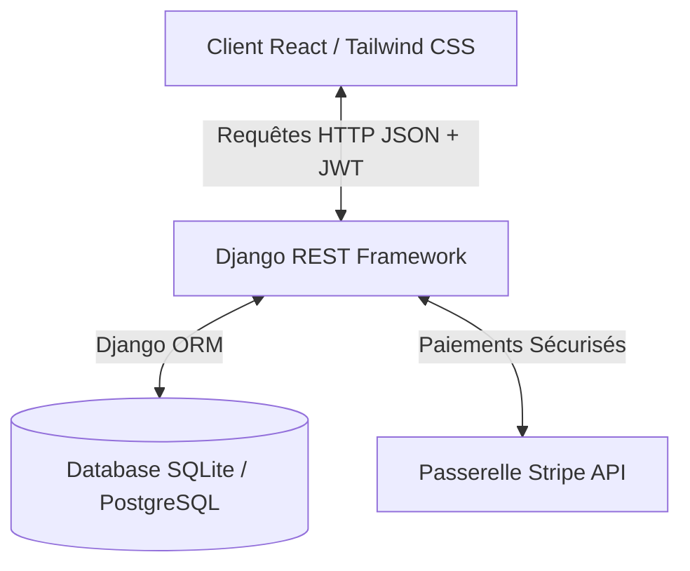
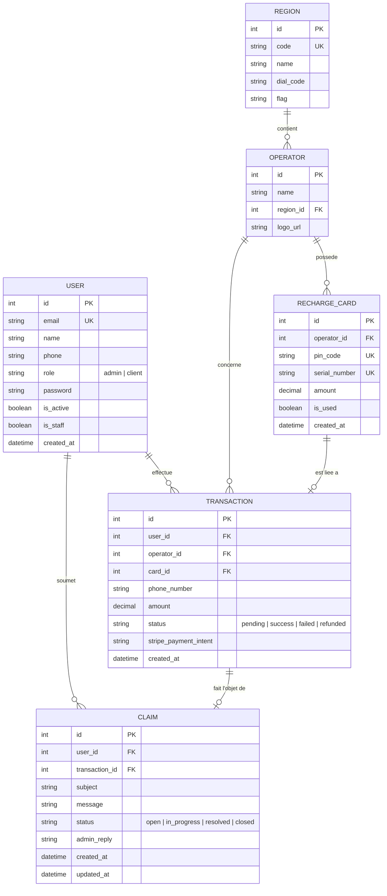

# Document d'Architecture Technique - FlashSim 📶✨

Ce document présente l'architecture globale de la plateforme **FlashSim**, les technologies utilisées, ainsi que la structure complète de la base de données (tables, attributs, types et relations).

---

## 📂 1. Architecture Logicielle Globale

FlashSim est conçu selon une architecture **Client-Serveur Découplée (Single Page Application + API RESTful)**, garantissant une séparation claire des responsabilités, une performance maximale et une maintenance facilitée.

### 💻 Partie Frontend (Client)
Le frontend est une application moderne construite en **React** et compilée avec **Vite** pour des performances optimales.
* **Aesthetics & UI** : Design haut de gamme avec effet de verre poli (*glassmorphism*), gradients fluides, animations micro-interactives (Tailwind CSS, transitions personnalisées).
* **State Management** : Utilisation de **React Context** (`CartContext`) pour un panier d'achat persistant et global.
* **Sécurité & Accès** : Système de routage avancé (`React Router`) verrouillé par des composants de contrôle d'accès (`ProtectedRoute`, `PublicOnlyRoute` et `ProtectedAdminRoute`) pour empêcher les connexions ou accès illégitimes.
* **Consommation API** : Axios avec intercepteurs automatiques pour injecter les tokens d'authentification Bearer JWT à chaque requête.

### ⚙️ Partie Backend (Serveur API)
Le backend est une API robuste développée avec **Django** et **Django REST Framework (DRF)**.
* **Authentification** : Gestion des sessions sécurisées à l'aide de **JSON Web Tokens (JWT)** via `djangorestframework-simplejwt`.
* **Paiements** : Intégration de la passerelle **Stripe** avec gestion automatique du taux de change DT ➔ EUR en arrière-plan pour contourner les limitations de devises régionales de Stripe.
* **Sécurité ORM** : Validation stricte des clés étrangères, clés uniques et contraintes d'intégrité de la base de données.

---

## 🛠️ 2. Technologies Utilisées

| Composant | Technologie | Rôle / Usage |
| :--- | :--- | :--- |
| **Frontend Core** | **React 18** | Structure logique et réactivité de l'application. |
| **Frontend Compiler**| **Vite** | Compilation ultra-rapide des assets de production. |
| **Styling & Design** | **Tailwind CSS** | Styling moderne, glassmorphism, animations et responsive design. |
| **Routage Frontend** | **React Router DOM v6**| Navigation monopage fluide et barrières d'accès aux routes. |
| **API Client** | **Axios** | Requêtes asynchrones vers le serveur backend. |
| **Backend Core** | **Django 5.0** | Framework d'application robuste et sécurisé. |
| **REST APIs** | **Django REST Framework**| Développement des endpoints d'API RESTful. |
| **Authentification** | **SimpleJWT** | Authentification sans état via tokens JWT d'accès et de rafraîchissement. |
| **Base de Données** | **SQLite (Dev) / PostgreSQL**| Persistance relationnelle conforme ACID. |
| **Passerelle Paiement**| **Stripe SDK** | Traitement sécurisé des cartes de crédit. |

---

## 📊 3. Modèle Physique des Données (Base de Données)

Le schéma ci-dessous illustre la structure relationnelle de la base de données de FlashSim.

---

