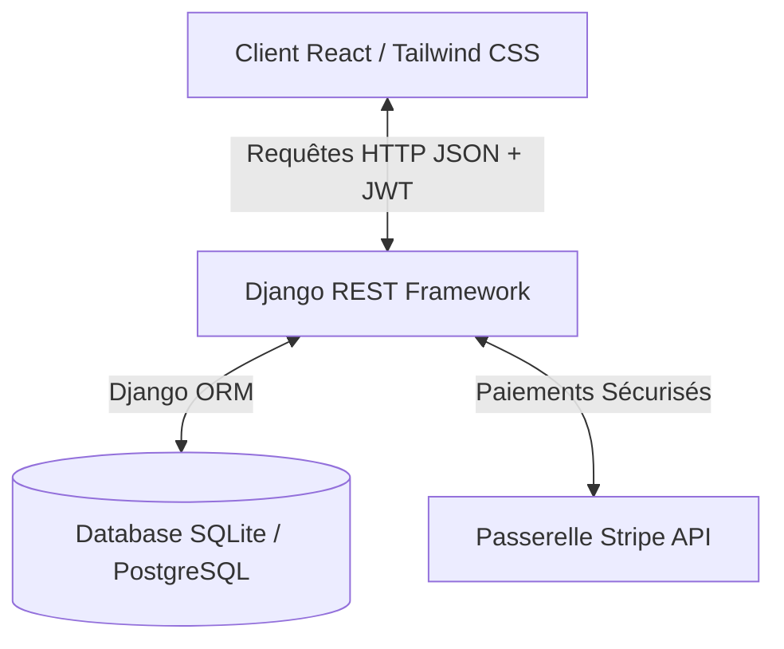
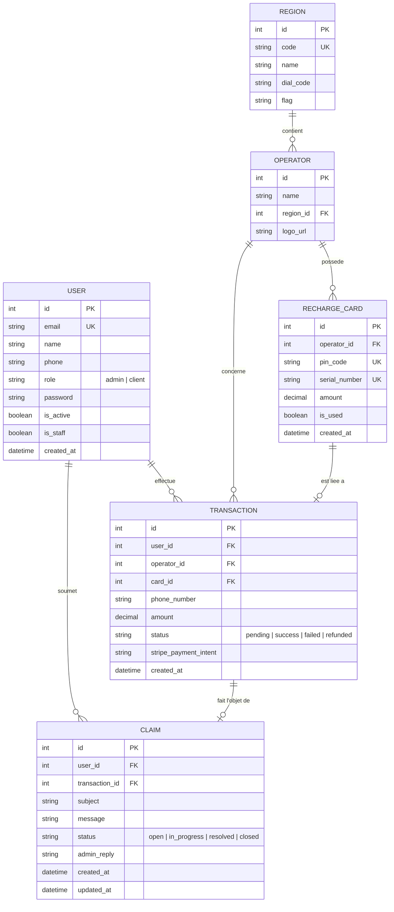

# Document d'Architecture Technique - FlashSim 📶✨

Ce document présente l'architecture globale de la plateforme **FlashSim**, les technologies utilisées, ainsi que la structure complète de la base de données (tables, attributs, types et relations).

---

## 📂 1. Architecture Logicielle Globale

FlashSim est conçu selon une architecture **Client-Serveur Découplée (Single Page Application + API RESTful)**, garantissant une séparation claire des responsabilités, une performance maximale et une maintenance facilitée.

### 💻 Partie Frontend (Client)
Le frontend est une application moderne construite en **React** et compilée avec **Vite** pour des performances optimales.
* **Aesthetics & UI** : Design haut de gamme avec effet de verre poli (*glassmorphism*), gradients fluides, animations micro-interactives (Tailwind CSS, transitions personnalisées).
* **State Management** : Utilisation de **React Context** (`CartContext`) pour un panier d'achat persistant et global.
* **Sécurité & Accès** : Système de routage avancé (`React Router`) verrouillé par des composants de contrôle d'accès (`ProtectedRoute`, `PublicOnlyRoute` et `ProtectedAdminRoute`) pour empêcher les connexions ou accès illégitimes.
* **Consommation API** : Axios avec intercepteurs automatiques pour injecter les tokens d'authentification Bearer JWT à chaque requête.

### ⚙️ Partie Backend (Serveur API)
Le backend est une API robuste développée avec **Django** et **Django REST Framework (DRF)**.
* **Authentification** : Gestion des sessions sécurisées à l'aide de **JSON Web Tokens (JWT)** via `djangorestframework-simplejwt`.
* **Paiements** : Intégration de la passerelle **Stripe** avec gestion automatique du taux de change DT ➔ EUR en arrière-plan pour contourner les limitations de devises régionales de Stripe.
* **Sécurité ORM** : Validation stricte des clés étrangères, clés uniques et contraintes d'intégrité de la base de données.

---

## 🛠️ 2. Technologies Utilisées

| Composant | Technologie | Rôle / Usage |
| :--- | :--- | :--- |
| **Frontend Core** | **React 18** | Structure logique et réactivité de l'application. |
| **Frontend Compiler**| **Vite** | Compilation ultra-rapide des assets de production. |
| **Styling & Design** | **Tailwind CSS** | Styling moderne, glassmorphism, animations et responsive design. |
| **Routage Frontend** | **React Router DOM v6**| Navigation monopage fluide et barrières d'accès aux routes. |
| **API Client** | **Axios** | Requêtes asynchrones vers le serveur backend. |
| **Backend Core** | **Django 5.0** | Framework d'application robuste et sécurisé. |
| **REST APIs** | **Django REST Framework**| Développement des endpoints d'API RESTful. |
| **Authentification** | **SimpleJWT** | Authentification sans état via tokens JWT d'accès et de rafraîchissement. |
| **Base de Données** | **SQLite (Dev) / PostgreSQL**| Persistance relationnelle conforme ACID. |
| **Passerelle Paiement**| **Stripe SDK** | Traitement sécurisé des cartes de crédit. |

---

## 📊 3. Modèle Physique des Données (Base de Données)

Le schéma ci-dessous illustre la structure relationnelle de la base de données de FlashSim.

---

## 📝 4. Description Détaillée des Tables et Attributs

### 👤 Table `User` (Utilisateurs)
Enregistre les administrateurs et les clients de la plateforme.
* **`id`** (`Auto-incrementing Integer`) : Clé primaire unique.
* **`email`** (`Varchar(254)`) : Identifiant unique de connexion, indexé et obligatoire.
* **`name`** (`Varchar(150)`) : Nom complet ou prénom de l'utilisateur.
* **`phone`** (`Varchar(20)`) : Numéro de téléphone (facultatif).
* **`role`** (`Varchar(10)`) : Rôle d'accès (`'admin'` ou `'client'`). Valeur par défaut : `'client'`.
* **`password`** (`Varchar(128)`) : Empreinte de hachage sécurisée du mot de passe (PBKDF2).
* **`is_active`** (`Boolean`) : Indique si le compte est actif.
* **`is_staff`** (`Boolean`) : Permet l'accès à l'interface d'administration Django.
* **`created_at`** (`Datetime`) : Date et heure de création automatique du compte.

### 🌍 Table `Region` (Pays / Régions)
Définit les zones géographiques pour les recharges.
* **`id`** (`Integer`) : Clé primaire.
* **`code`** (`Varchar(10)`) : Code unique du pays (ex: `TN`, `FR`).
* **`name`** (`Varchar(100)`) : Nom du pays (ex: `Tunisie`, `France`).
* **`dial_code`** (`Varchar(10)`) : Indicatif téléphonique (ex: `+216`, `+33`).
* **`flag`** (`Varchar(10)`) : Émoji drapeau représentatif (ex: `🇹🇳`, `🇫🇷`).

### 📶 Table `Operator` (Opérateurs de Téléphonie)
Contient les opérateurs partenaires rattachés à chaque région.
* **`id`** (`Integer`) : Clé primaire.
* **`name`** (`Varchar(100)`) : Nom de l'opérateur (ex: `Ooredoo`, `Orange`).
* **`region_id`** (`Integer`) : Clé étrangère (**FK**) pointant vers la table `Region` (`on_delete=models.CASCADE`).
* **`logo_url`** (`URLField`) : Lien absolu vers le logo officiel en couleur de l'opérateur.

### 🎫 Table `RechargeCard` (Cartes de Recharge)
Stocke les codes PIN et numéros de série des cartes physiques pré-chargées.
* **`id`** (`Integer`) : Clé primaire.
* **`operator_id`** (`Integer`) : Clé étrangère (**FK**) pointant vers la table `Operator` (`on_delete=models.CASCADE`).
* **`pin_code`** (`Varchar(50)`) : Code PIN unique de recharge utilisé pour recharger le solde mobile (ex: `98765432101234`).
* **`serial_number`** (`Varchar(100)`) : Numéro de série unique de la carte.
* **`amount`** (`Decimal(10,2)`) : Valeur nominale de la recharge (ex: `10.00`).
* **`is_used`** (`Boolean`) : Statut d'utilisation de la carte. Vaut `true` après achat réussi.
* **`created_at`** (`Datetime`) : Date d'ajout de la carte dans le système.

### 💰 Table `Transaction` (Achat de Recharges)
Historise les paiements et les attributions de codes PIN de recharge.
* **`id`** (`Integer`) : Clé primaire.
* **`user_id`** (`Integer`) : Clé étrangère (**FK**) pointant vers `User` (`on_delete=models.SET_NULL`).
* **`operator_id`** (`Integer`) : Clé étrangère (**FK**) pointant vers `Operator` (`on_delete=models.SET_NULL`).
* **`card_id`** (`Integer`) : Clé étrangère (**FK**) pointant vers `RechargeCard` (facultatif, `on_delete=models.SET_NULL`).
* **`phone_number`** (`Varchar(20)`) : Numéro de téléphone crédité.
* **`amount`** (`Decimal(10,2)`) : Montant payé.
* **`status`** (`Varchar(20)`) : Statut de la transaction (`'pending'`, `'success'`, `'failed'`, `'refunded'`).
* **`stripe_payment_intent`** (`Varchar(200)`) : ID unique d'intention de paiement Stripe pour les rapprochements bancaires.
* **`created_at`** (`Datetime`) : Date d'achat automatique.

### 🛠️ Table `Claim` (Réclamations Support)
Permet aux clients d'ouvrir des tickets de support liés à leurs transactions.
* **`id`** (`Integer`) : Clé primaire.
* **`user_id`** (`Integer`) : Clé étrangère (**FK**) pointant vers `User` (`on_delete=models.CASCADE`).
* **`transaction_id`** (`Integer`) : Clé étrangère (**FK**) pointant vers `Transaction` (facultatif, `on_delete=models.SET_NULL`).
* **`subject`** (`Varchar(200)`) : Sujet ou titre de la réclamation.
* **`message`** (`Text`) : Message explicatif rédigé par l'utilisateur.
* **`status`** (`Varchar(20)`) : Statut du ticket (`'open'`, `'in_progress'`, `'resolved'`, `'closed'`). Valeur par défaut : `'open'`.
* **`admin_reply`** (`Text`) : Réponse rédigée par l'administrateur de FlashSim (facultatif).
* **`created_at`** (`Datetime`) : Date de soumission.
* **`updated_at`** (`Datetime`) : Date de dernière mise à jour par l'administrateur.
